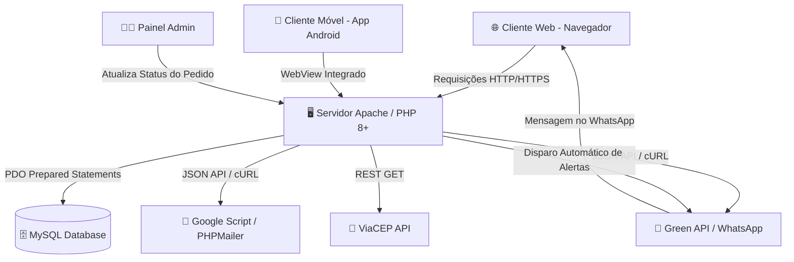

# <p align="center"></p>

<h1 align="center">Palazzo Essenza</h1>

<p align="center">
  <b>Ecossistema Digital Gastronômico de Alta Cucina Italiana</b><br>
  Plataforma Web Full-Stack com Sistema de Pedidos, Reservas, Painel Administrativo e Aplicativo Móvel Integrado.
</p>

<p align="center">
  <a href="app/Palazzo-Essenza.apk"></a>
  
  
  
  
  
</p>

---

## 📌 Sumário

1. [Sobre o Projeto](#-sobre-o-projeto)
2. [Principais Funcionalidades](#-principais-funcionalidades)
3. [Design System & Experiência Visual (UX/UI)](#-design-system--experiência-visual-uxui)
4. [Estrutura Organizada do Repositório](#-estrutura-organizada-do-repositório)
5. [Aplicativo Móvel Android (APK)](#-aplicativo-móvel-android-apk)
6. [Arquitetura & Engenharia de Software](#-arquitetura--engenharia-de-software)
7. [Modelo do Banco de Dados](#-modelo-do-banco-de-dados)
8. [Integrações e APIs Externas](#-integrações-e-apis-externas)
9. [Como Executar o Projeto Localmente](#-como-executar-o-projeto-localmente)
10. [Segurança e Boas Práticas](#-segurança-e-boas-práticas)
11. [Licença e Autoria](#-licença-e-autoria)

---

## 🍽️ Sobre o Projeto

O **Palazzo Essenza** é um ecossistema digital desenvolvido para proporcionar uma experiência gastronômica de alto padrão inspirada na autêntica tradição italiana (*Alta Cucina Italiana*). A solução une clientes e a cozinha através de uma arquitetura omnichannel integrada:

- **Plataforma Web Completa:** Desenvolvida em **PHP 8+** e **MySQL**, com interface moderna em **HTML5**, **CSS3 (Glassmorphism)** e **JavaScript Vanilla**, permitindo cardápio digital interativo, personalização de massas artesanais, carrinho com checkout inteligente e gestão de reservas.
- **Aplicativo Móvel Android:** Desenvolvido em **Kotlin** e **Jetpack Compose** com *Arquitetura Híbrida Centrada no Servidor (Server-Centric Hybrid)*, garantindo sincronização instantânea de dados, splash screen nativa com animação luminosa e tratamento de conectividade offline.
- **Painel Administrativo:** Interface em tempo real para controle da cozinha e despacho de pedidos, disparando mensagens automáticas para o cliente via WhatsApp e E-mail a cada mudança de status.

---

## ✨ Principais Funcionalidades

### 🍝 Cardápio Digital & "Monte sua Massa" (`cardapio.php`)
- **Navegação Categorizada:** Entradas Clássicas, Pratos Principais, Sobremesas, Sucos e Bebidas Especiais.
- **Customização de Pratos:** Seção interativa onde o cliente escolhe tipos de massa (Espaguete, Penne, Fusilli), molhos artesanais e adicionais (parmesão, bacon crocante, cogumelos frescos, frango em cubos, etc.), com cálculo dinâmico de valor.
- **Modal de Seleção de Bebidas:** Seleção rápida e responsiva de opções adicionais (como sabores e tamanhos de sucos naturais).

### 🛒 Carrinho Dinâmico & Checkout Inteligente
- **Blindagem Contra Scroll Vazado:** Drawer lateral flutuante com `overscroll-behavior: none` e `-webkit-overflow-scrolling: touch`, garantindo rolagem 100% contínua e sem travamento em dispositivos móveis.
- **Preenchimento Automático de Endereço (ViaCEP):** Ao digitar o CEP na modalidade delivery, o sistema preenche logradouro, bairro, cidade e estado em tempo real.
- **Cartão de Crédito 3D Interativo:** 
  - Animação em perspectiva 3D que gira o cartão (*card flip*) ao preencher o código de segurança (CVV).
  - Reconhecimento dinâmico da bandeira (*Visa, Mastercard, Amex, Elo, Hipercard*) via Regex.
  - Validação matemática de integridade através do **Algoritmo de Luhn (Módulo 10)** antes do envio.
- **Suporte a Múltiplos Pagamentos:** Pix, Cartão de Crédito, Cartão de Débito e Dinheiro (com cálculo automático de troco).

### 📅 Reserva de Mesas (`reserva.php`)
- Sistema inteligente de agendamento validando:
  - Limite de até 10 pessoas por mesa.
  - Restrição de reservas apenas para o mês corrente.
  - Verificação de horário de funcionamento do restaurante (18:00 às 00:30).
- Confirmação automática via WhatsApp com os dados da reserva.

### 📦 Rastreamento de Pedidos (`meus_pedidos.php`)
- Listagem detalhada dos pedidos do cliente com identificador único (`#ID`).
- **Badges de Status Dinâmicos:**
  - 🟡 **Preparando:** Pedido recebido e em preparo pelo chef.
  - 🔵 **Enviado:** Saiu para rota de entrega.
  - 🟢 **Finalizado:** Pedido entregue ou retirado com sucesso.
- Histórico de itens, observações, troco e opção de cancelamento de reservas com aviso imediato à administração.

### 👨‍🍳 Painel Administrativo (`admin.php`)
- Visão geral de todos os pedidos ativos e reservas pendentes.
- Atualização em um clique do status do pedido (`Preparando` ➡️ `Enviado` ➡️ `Finalizado`).
- Despacho automático de notificações no WhatsApp do cliente e e-mail transacional a cada atualização.
- Função de impressão de comanda de pedidos para a cozinha (`imprimir_pedido.php`).

---

## 🎨 Design System & Experiência Visual (UX/UI)

O design foi construído seguindo diretrizes de sofisticação, combinando tons clássicos de ouro e champanhe com a profundidade do tema escuro:

| Elemento | Tema Claro (*Light*) | Tema Escuro (*Dark*) |
| :--- | :--- | :--- |
| **Cor Primária / Destaque** | `#8b6932` (Ouro Envelhecido) | `#e6c97a` / `#c6a75e` (Dourado Nobre) |
| **Fundo Principal** | `#ffffff` / Gradiente translúcido | `#121212` (Preto Profundo) |
| **Tipografia Títulos** | *Playfair Display* (Serifada elegante) | *Playfair Display* (Serifada elegante) |
| **Tipografia Corpo** | *Poppins* (Moderna e legível) | *Poppins* (Moderna e legível) |
| **Superfícies & Cards** | Glassmorphism (`backdrop-filter: blur(15px)`) | Vidro escurecido com bordas sutis |

- **Persistência de Tema:** A preferência de tema é gravada no `localStorage` sob a chave `palazzo_theme`, garantindo consistência em todas as páginas e navegações.
- **Botão de Download Interativo (`.btn-download-app`):** Efeito de hover suave onde o ícone de download expande elegantemente sobre toda a extensão do botão.
- **Botões Flutuantes (FABs):** Acesso rápido aos canais oficiais de atendimento (WhatsApp e E-mail).

---

## 📂 Estrutura Organizada do Repositório

O repositório está padronizado e separado por responsabilidades:

```plaintext
Palazzo-Essenza/
├── app/                                # Aplicativo Móvel Android
│   ├── Palazzo-Essenza.apk             # Pacote APK instalável (~23.5 MB)
│   └── README.md                       # Instruções de instalação do app
│
├── assets/                             # Arquivos estáticos da interface
│   ├── css/                            # Folhas de estilo modularizadas
│   │   ├── admin.css                   # Estilos do painel gerencial
│   │   ├── cardapio.css                # Estilos do cardápio e carrinho
│   │   ├── index.css                   # Estilos da Home, Hero e navegação
│   │   ├── login.css                   # Estilos das telas de autenticação
│   │   ├── meus_pedidos.css            # Estilos do histórico e badges
│   │   ├── reserva.css                 # Estilos do agendamento de mesas
│   │   └── telacadastro.css            # Estilos da tela de registro
│   └── img/                            # Imagens e ícones
│       ├── logo.png                    # Logotipo oficial em alta resolução
│       └── logoP.ico                   # Favicon do restaurante
│
├── database/                           # Banco de Dados MySQL
│   ├── palazzo_db.sql                  # Script SQL com tabelas e dados iniciais
│   └── README.md                       # Guia de importação do banco
│
├── src/                                # Bibliotecas e serviços externos
│   ├── DSNConfigurator.php
│   ├── Exception.php
│   ├── OAuth.php
│   ├── OAuthTokenProvider.php
│   ├── PHPMailer.php                   # Biblioteca PHPMailer para e-mails
│   ├── POP3.php
│   └── SMTP.php
│
├── index.php                           # Página inicial / Landing Page
├── cardapio.php                        # Cardápio interativo e checkout
├── login.php                           # Login de usuários
├── telacadastro.php                    # Formulário de cadastro
├── meus_pedidos.php                    # Acompanhamento de pedidos e reservas
├── reserva.php                         # Agendamento de mesas
├── perfil.php                          # Edição de perfil do cliente
├── admin.php                           # Painel de gestão da cozinha
├── conexao.php                         # Conexão PDO com MySQL
├── finalizar_pedido.php                # Processamento do pedido e APIs
├── confirmar_entrega.php               # Confirmação de recebimento
├── imprimir_pedido.php                 # Impressão térmica de comanda
├── processa_login.php                  # Validação de credenciais e BCRYPT
├── processa_cadastro.php               # Registro de novos usuários
├── ativar_conta.php                    # Validação do código em duas etapas
├── recuperar_senha.php                 # Solicitação de redefinição de senha
├── nova_senha.php                      # Criação de nova senha
├── logout.php                          # Encerramento de sessão
└── README.md                           # Documentação oficial do projeto
```

---

## 📱 Aplicativo Móvel Android (APK)

O aplicativo oficial está disponível diretamente na pasta [`app/`](./app):

- 📦 **Arquivo:** [`app/Palazzo-Essenza.apk`](./app/Palazzo-Essenza.apk)
- ⚙️ **Versão:** 1.0 (SDK 24+)
- 🎨 **Tecnologia:** Kotlin + Jetpack Compose + Material Design 3
- 🚀 **Funcionalidades:**
  - Splash Screen nativa animada com efeito *Breathing Light*.
  - Navegação nativa sincronizada com `BackHandler`.
  - Tratamento de conexão com tela offline amigável.
  - Abertura direta de discador, WhatsApp e cliente de e-mail.

Para instruções completas de instalação, consulte o guia em [app/README.md](./app/README.md).

---

## 🏛️ Arquitetura & Engenharia de Software



---

## 🗄️ Modelo do Banco de Dados

O script completo está disponível em [`database/palazzo_db.sql`](./database/palazzo_db.sql):

- **`usuarios`**: Controle de usuários, contendo `nome`, `email`, `senha` (hash BCRYPT), `telefone`, `foto_perfil` (MEDIUMBLOB), `codigo_ativacao` (2FA) e flag `is_admin`.
- **`categorias`**: Separação dos pratos (`Entradas Clássicas`, `Pratos Principais`, `Sobremesas`, `Bebidas`).
- **`produtos`**: Pratos e bebidas cadastrados com nome, descrição, valor e status de disponibilidade.
- **`pedidos`**: Registro mestre de compras com `usuario_id`, `total`, `status` (`preparando`, `enviado`, `finalizado`), `troco_para` e data de criação.
- **`itens_pedido`**: Composição detalhada de cada prato, incluindo montagens especiais e ingredientes adicionais escolhidos.
- **`reservas`**: Dados de agendamento de mesa, horário, quantidade de pessoas, observações e status.

---

## 🔌 Integrações e APIs Externas

1. **WhatsApp Notifier (Green API / Periskope):**
   - Disparo automático de mensagens a cada alteração no ciclo do pedido:
     - 👨‍🍳 *Pedido Confirmado e Sendo Preparado*
     - 🛵 *Saiu para Entrega (com instrução de confirmação)*
     - ✅ *Pedido Finalizado com Sucesso*
2. **Google Apps Script / PHPMailer:**
   - Envio de comprovantes em HTML estilizado com resumo da compra e avisos de cancelamento de reservas para os administradores.
3. **ViaCEP API:**
   - Consulta assíncrona de endereços brasileiros via CEP sem necessidade de recarregar a página.

---

## 🚀 Como Executar o Projeto Localmente

### Pré-requisitos
- **PHP 8.0** ou superior instalado
- **MySQL / MariaDB**
- Servidor Web local (**XAMPP**, **WampServer**, **Laragon** ou servidor embutido do PHP)
- Extensões PHP habilitadas: `pdo_mysql`, `curl`, `mbstring`, `openssl`

### Passo a Passo

1. **Clonar o Repositório:**
   ```bash
   git clone https://github.com/iverVale/Palazzo-Essenza.git
   cd Palazzo-Essenza
   ```

2. **Configurar o Banco de Dados:**
   - Crie uma base de dados no seu MySQL (ex: `palazzo_db`).
   - Importe o arquivo `database/palazzo_db.sql` via phpMyAdmin ou terminal.
   - Ajuste as credenciais no arquivo `conexao.php`:
     ```php
     $host = 'localhost';
     $dbname = 'palazzo_db';
     $user = 'root';
     $pass = '';
     ```

3. **Iniciar o Servidor:**
   - Se estiver usando o **XAMPP**, mova a pasta do projeto para `htdocs` e acesse no navegador:
     ```plaintext
     http://localhost/Palazzo-Essenza/
     ```
   - Ou utilize o servidor embutido do próprio PHP:
     ```bash
     php -S localhost:8000
     ```
     E acesse: `http://localhost:8000`

---

## 🛡️ Segurança e Boas Práticas

- **Prevenção contra SQL Injection:** 100% das operações de banco utilizam o driver PDO com *Prepared Statements* e parâmetros vinculados.
- **Criptografia Forte de Senhas:** Nenhuma senha em texto plano. Utilização de `password_hash()` com algoritmo `PASSWORD_DEFAULT` (BCRYPT) e verificação com `password_verify()` protegendo contra *timing attacks*.
- **Controle de Sessão e Rotas Protegidas:** Verificação de autenticação no início de páginas restritas (`$_SESSION['usuario_id']` e `$_SESSION['is_admin']`).
- **Timeouts Controlados:** Chamadas cURL com timeout fixado em 5 segundos para impedir que lentidões em APIs externas congelem a aplicação.

---

## 👥 Licença e Autoria

Desenvolvido com carinho e dedicação para proporcionar o melhor da tecnologia e gastronomia italiana.

<p align="center">
  <b>Buon Appetito! 🍷🍝</b><br>
  <i>Palazzo Essenza © Todos os direitos reservados.</i>
</p>
